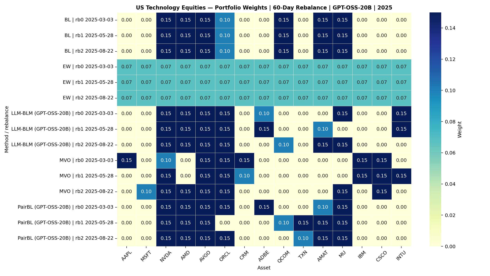
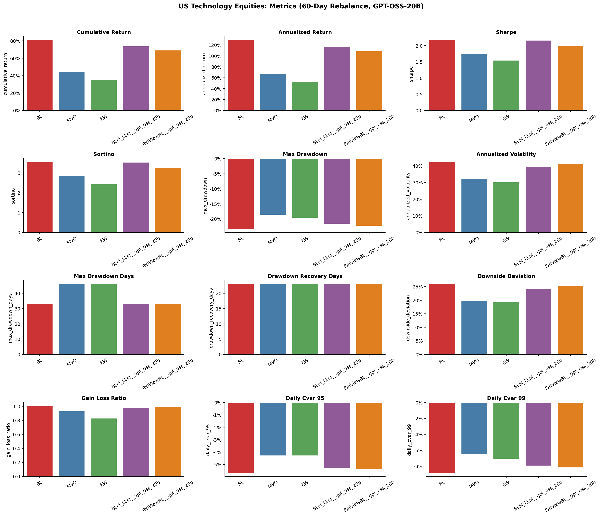
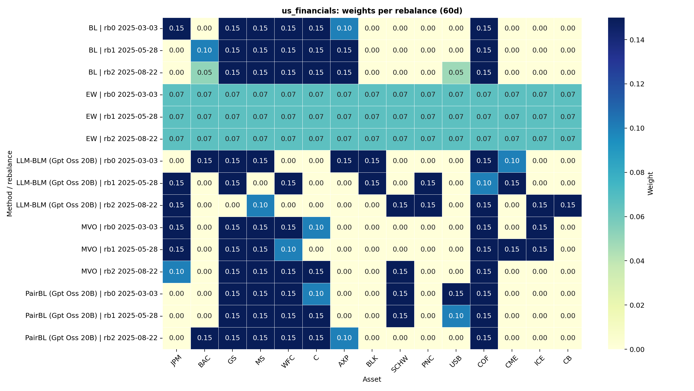
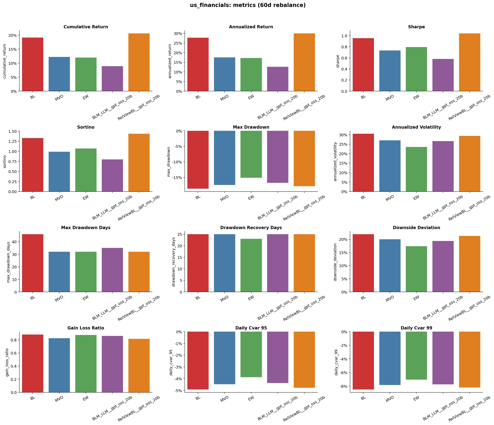
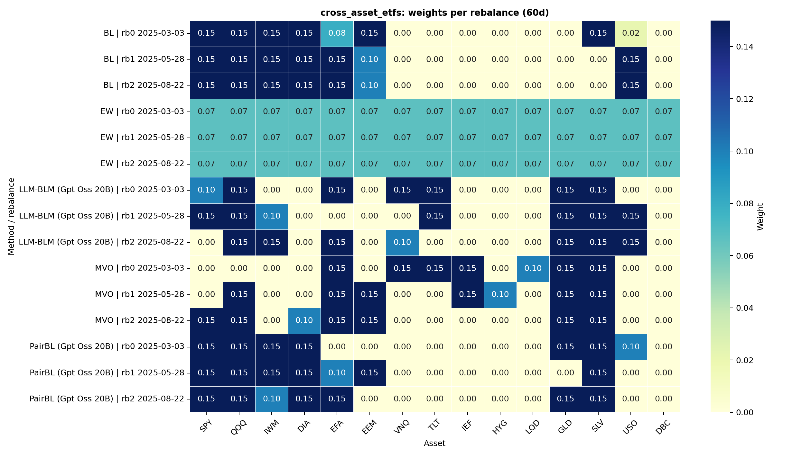
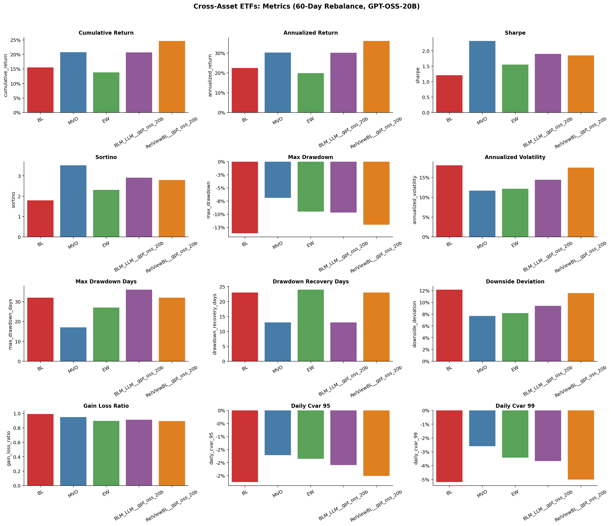

# LLM-BLM / PairBL portfolio research with GPT-OSS-20B

Walk-forward rebalance backtest chạy **hoàn toàn trong năm 2025**, dùng **GPT-OSS-20B** (qua NVIDIA NIM) để tạo absolute views (LLM-BLM) và relative pairwise views (PairBL / RelView-BL). Tại mỗi rebalance, LLM và optimizer được chạy lại với cửa sổ formation là **~252 phiên gần nhất (khoảng 1 năm, gồm 2024-H2 và 2025)**, rồi giữ nguyên bộ trọng số cho N phiên kế tiếp. Kết quả là một đường NAV liên tục cho mỗi method ở mỗi chu kỳ holding period.

Trong các bảng, **in đậm** là giá trị tốt nhất cho metric đó và <u>gạch chân</u> là tốt thứ hai.

## Kết quả backtest 2025 (holding 30 ngày)

### US Technology Equities

| Method                | Cum. return   | Ann. return   | Sharpe      | Sortino     | Max DD        | Final NAV   |   Rebal |
|:----------------------|:--------------|:--------------|:------------|:------------|:--------------|:------------|--------:|
| BL                    | **81.6%**     | **104.7%**    | <u>1.93</u> | <u>3.05</u> | -23.3%        | **1.82**    |       7 |
| MVO                   | 50.4%         | 63.2%         | 1.67        | 2.66        | -18.6%        | 1.50        |       7 |
| EW                    | 39.1%         | 48.5%         | 1.51        | 2.33        | -19.5%        | 1.39        |       7 |
| LLM-BLM (GPT-OSS-20B) | 44.3%         | 55.3%         | 1.59        | 2.47        | <u>-18.6%</u> | 1.44        |       7 |
| PairBL (GPT-OSS-20B)  | <u>78.6%</u>  | <u>100.6%</u> | **2.24**    | **3.63**    | **-17.1%**    | <u>1.79</u> |       7 |


### US Financial Equities

| Method                | Cum. return   | Ann. return   | Sharpe      | Sortino     | Max DD        | Final NAV   |   Rebal |
|:----------------------|:--------------|:--------------|:------------|:------------|:--------------|:------------|--------:|
| BL                    | **36.2%**     | **44.9%**     | <u>1.42</u> | <u>2.01</u> | -18.6%        | **1.36**    |       7 |
| MVO                   | 21.5%         | 26.3%         | 1.05        | 1.43        | -17.5%        | 1.21        |       7 |
| EW                    | 23.9%         | 29.4%         | 1.27        | 1.74        | <u>-15.1%</u> | 1.24        |       7 |
| LLM-BLM (GPT-OSS-20B) | 30.4%         | 37.5%         | **1.61**    | **2.36**    | **-12.9%**    | 1.30        |       7 |
| PairBL (GPT-OSS-20B)  | <u>32.9%</u>  | <u>40.7%</u>  | 1.35        | 1.88        | -18.6%        | <u>1.33</u> |       7 |


### Cross-Asset ETFs

| Method                | Cum. return   | Ann. return   | Sharpe      | Sortino     | Max DD       | Final NAV   |   Rebal |
|:----------------------|:--------------|:--------------|:------------|:------------|:-------------|:------------|--------:|
| BL                    | 24.6%         | 30.2%         | 1.58        | 2.36        | -13.6%       | 1.25        |       7 |
| MVO                   | <u>31.3%</u>  | <u>38.7%</u>  | **2.73**    | **4.17**    | **-6.9%**    | <u>1.31</u> |       7 |
| EW                    | 18.7%         | 22.9%         | 1.82        | 2.71        | -9.5%        | 1.19        |       7 |
| LLM-BLM (GPT-OSS-20B) | 21.5%         | 26.4%         | 2.02        | 3.01        | <u>-8.4%</u> | 1.22        |       7 |
| PairBL (GPT-OSS-20B)  | **33.1%**     | **40.9%**     | <u>2.13</u> | <u>3.17</u> | -12.1%       | **1.33**    |       7 |


## Kết quả backtest 2025 (holding 60 ngày)

### US Technology Equities

| Method                | Cum. return   | Ann. return   | Sharpe      | Sortino     | Max DD        | Final NAV   |   Rebal |
|:----------------------|:--------------|:--------------|:------------|:------------|:--------------|:------------|--------:|
| BL                    | **80.8%**     | **129.1%**    | **2.17**    | **3.54**    | -23.3%        | **1.81**    |       3 |
| MVO                   | 44.3%         | 67.1%         | 1.75        | 2.86        | **-18.6%**    | 1.44        |       3 |
| EW                    | 34.9%         | 52.1%         | 1.54        | 2.42        | <u>-19.5%</u> | 1.35        |       3 |
| LLM-BLM (GPT-OSS-20B) | <u>73.6%</u>  | <u>116.5%</u> | <u>2.16</u> | <u>3.52</u> | -21.6%        | <u>1.74</u> |       3 |
| PairBL (GPT-OSS-20B)  | 69.0%         | 108.4%        | 1.99        | 3.25        | -22.2%        | 1.69        |       3 |






### US Financial Equities

| Method                | Cum. return   | Ann. return   | Sharpe      | Sortino     | Max DD        | Final NAV   |   Rebal |
|:----------------------|:--------------|:--------------|:------------|:------------|:--------------|:------------|--------:|
| BL                    | <u>19.1%</u>  | <u>27.8%</u>  | <u>0.96</u> | <u>1.33</u> | -18.6%        | <u>1.19</u> |       3 |
| MVO                   | 12.2%         | 17.5%         | 0.73        | 0.99        | -17.5%        | 1.12        |       3 |
| EW                    | 12.0%         | 17.2%         | 0.79        | 1.07        | **-15.1%**    | 1.12        |       3 |
| LLM-BLM (GPT-OSS-20B) | 8.9%          | 12.7%         | 0.58        | 0.80        | <u>-16.8%</u> | 1.09        |       3 |
| PairBL (GPT-OSS-20B)  | **20.6%**     | **30.0%**     | **1.04**    | **1.44**    | -17.9%        | **1.21**    |       3 |






### Cross-Asset ETFs

| Method                | Cum. return   | Ann. return   | Sharpe      | Sortino     | Max DD       | Final NAV   |   Rebal |
|:----------------------|:--------------|:--------------|:------------|:------------|:-------------|:------------|--------:|
| BL                    | 15.6%         | 22.4%         | 1.21        | 1.80        | -13.6%       | 1.16        |       3 |
| MVO                   | <u>20.8%</u>  | <u>30.3%</u>  | **2.32**    | **3.52**    | **-6.9%**    | <u>1.21</u> |       3 |
| EW                    | 13.9%         | 19.9%         | 1.55        | 2.31        | <u>-9.5%</u> | 1.14        |       3 |
| LLM-BLM (GPT-OSS-20B) | 20.7%         | 30.2%         | <u>1.90</u> | <u>2.91</u> | -9.7%        | 1.21        |       3 |
| PairBL (GPT-OSS-20B)  | **24.7%**     | **36.1%**     | 1.85        | 2.79        | -12.0%       | **1.25**    |       3 |






## Drawdown (holding 30 ngày)

### US Technology Equities


### US Financial Equities


### Cross-Asset ETFs


## Phương pháp

| Method | Loại |
|---|---|
| **BL** | Baseline (Black-Litterman equilibrium prior) |
| **MVO** | Baseline (Mean-Variance Optimization) |
| **EW** | Baseline (Equal Weight) |
| **LLM-BLM (GPT-OSS-20B)** | LLM absolute views + Black-Litterman |
| **PairBL (GPT-OSS-20B)** | LLM pairwise relative views + RelView-BL |

## Cấu trúc

- `run.py` — thu thập LLM views (absolute) và relative pairwise views
- `collect_relative_views.py` — thu thập sparse pairwise LLM views
- `relview_bl.py` — RelView-BL (PairBL) implementation
- `run_nvidia_nim_walkforward_2025.py` — walk-forward 2025 backtest runner
- `backtest_compare.py` — backtest và so sánh nhiều phương pháp
- `portfolio_backtest.py` — shared realized-return metrics
- `baselines.py` — baseline portfolio strategies (BL/MVO/EW)
- `responses/` — LLM predictions và views
- `results/` — kết quả đánh giá
- `yfinance/` — dữ liệu giá cổ phiếu
- `experiments/nvidia_nim_2025_walkforward/` — kết quả backtest 2025 (README chi tiết)

## Dữ liệu & tham số

| Tham số | Giá trị |
|---|---|
| Năm backtest | 2025 (01-02 → 12-31) |
| Holding periods | **30 ngày** và **60 ngày** |
| Formation look-back | ~252 phiên giao dịch (~1 năm) |
| Rebalance đầu tiên | sau ≥40 phiên formation |
| Model | `openai/gpt-oss-20b` (NVIDIA NIM) |
| Repeats / min calls | 2 / 2 |
| Max pairs (views) | 15 |
| Temperature | 0.3 |
| Calibration | none |
| Tau | 0.025 |
| Risk aversion | 0.1 |
| Max weight | 15% |
| Transaction cost | 10 bps |
| Reasoning effort | `low` (ổn định output) |

## Chạy lại

```powershell
$env:NVIDIA_API_KEY = "<key>"
py run_nvidia_nim_walkforward_2025.py --dry-run   # ước lượng số calls
py run_nvidia_nim_walkforward_2025.py             # chạy đầy đủ
```

## Guardrails

- Các LLM calls được thực hiện sau cửa sổ test với tên asset nhận diện được, nên kết quả có thể chịu ảnh hưởng của training-cutoff hoặc leakage phía nhà cung cấp dù pipeline số là point-in-time.
- Đây là kết quả nghiên cứu, không phải bằng chứng cho hiệu suất live.
