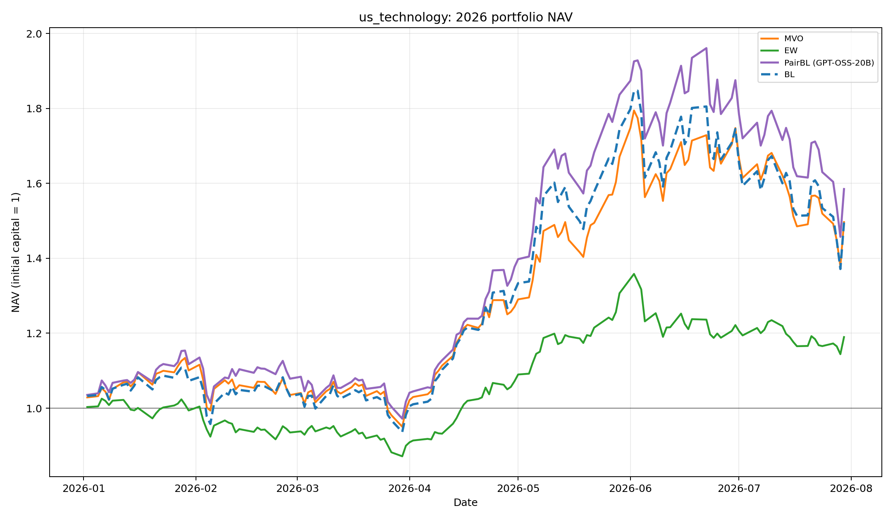
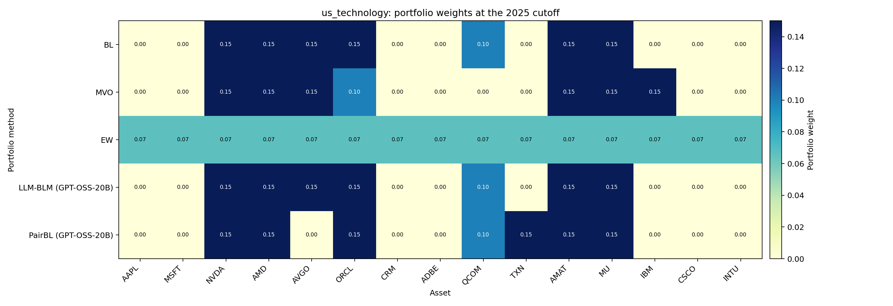
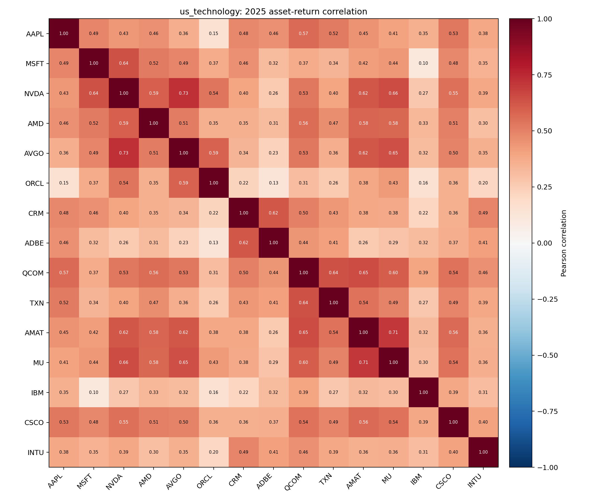
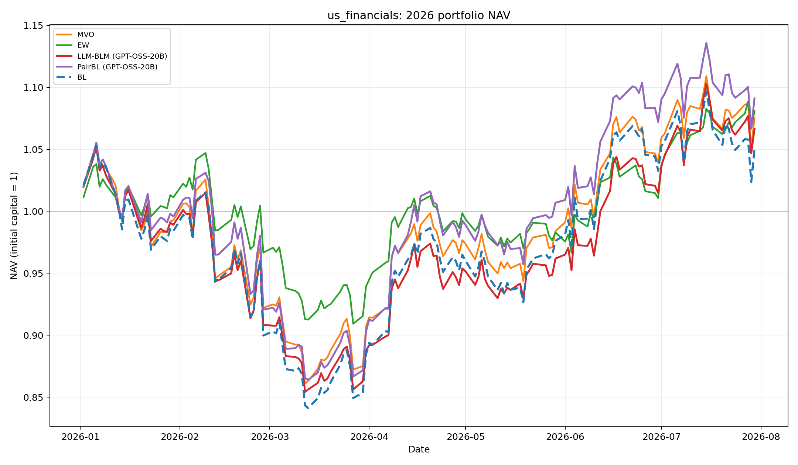
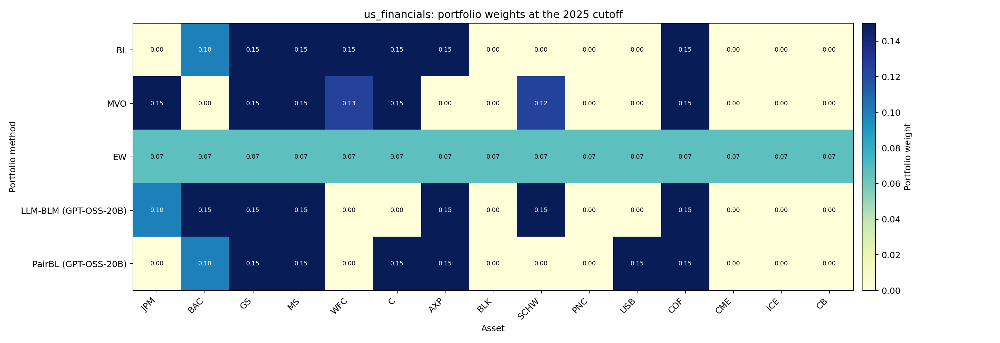
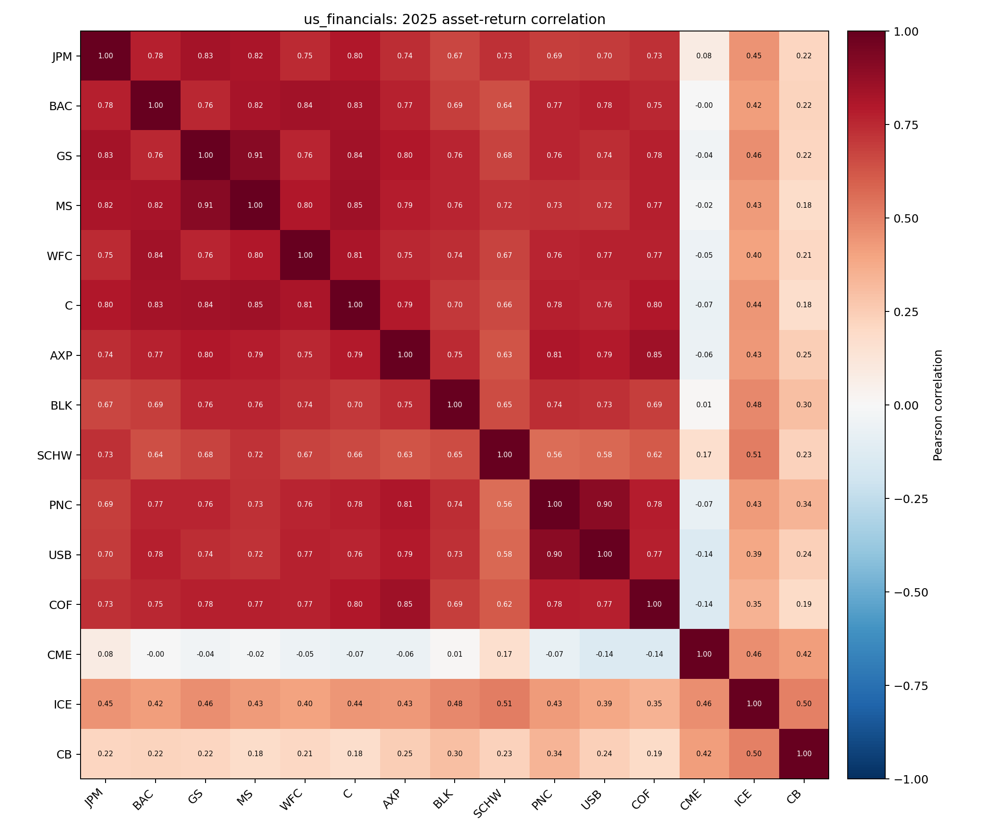
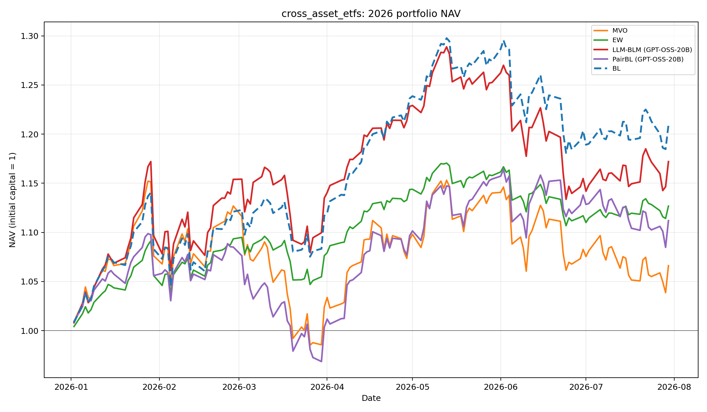
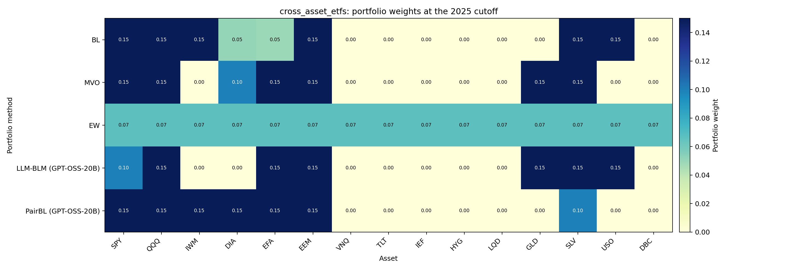
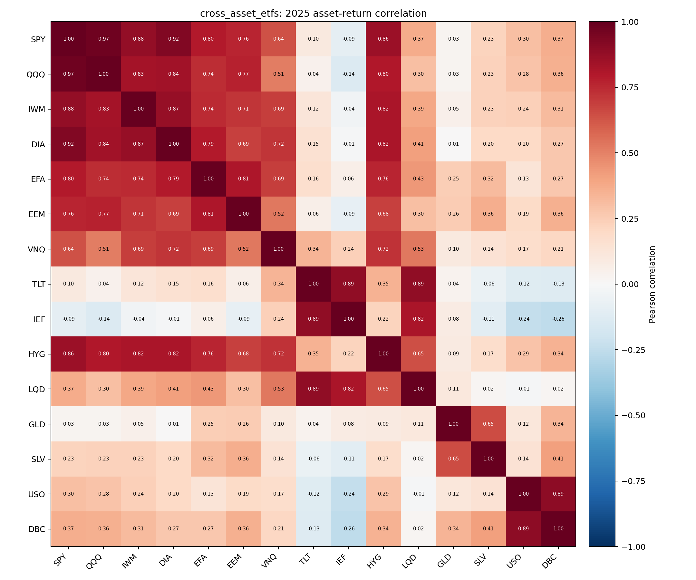
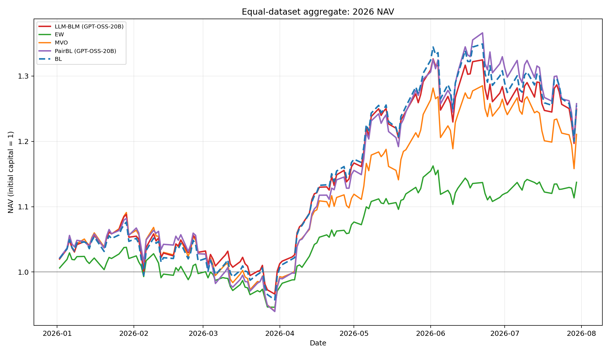

# Integrating LLM-Generated Views into Mean-Variance Optimization Using the Black-Litterman Model 

 > This is an official implementation of the paper [Integrating LLM-Generated Views into Mean-Variance Optimization Using the Black-Litterman Model](https://arxiv.org/abs/2504.14345), presented at ICLR 2025 Workshop on Advances in Financial AI.


## PairBL: 2025 Views and 2026 Backtest

The experiment forms each portfolio once using 250 daily return observations
from 2025 and holds the fixed weights over 144 trading sessions from 2 January
to 30 July 2026. All methods use the same long-only optimizer, 15% per-asset
cap, and 10 bps entry cost. PairBL uses GPT-OSS-20B through NVIDIA NIM, three
repeated calls per comparison, a 15-pair sparse comparison graph, and a 0.55
abstention threshold. The comparison methods are absolute-view LLM-BLM using
the same GPT-OSS-20B model, no-view Black--Litterman (BL), mean--variance
optimization (MVO), and equal weighting (EW).

The three 15-asset universes are US technology equities (including NVDA), US
financial equities, and cross-asset ETFs. The tables below contain every saved
evaluation metric for the five reported methods.

### US Technology Equities

| Method | Days | Cumulative return | Annualized return | Annualized volatility | Sharpe | Max drawdown | Sortino | Calmar | Final NAV |
|---|---:|---:|---:|---:|---:|---:|---:|---:|---:|
| BL | 144 | 49.55% | 102.25% | 47.39% | 1.724 | -25.75% | 2.559 | 3.970 | 1.496 |
| MVO | 144 | 49.66% | 102.52% | 43.50% | 1.841 | -23.18% | 2.776 | 4.422 | 1.497 |
| EW | 144 | 18.98% | 35.55% | 26.65% | 1.274 | -15.77% | 1.879 | 2.254 | 1.190 |
| LLM-BLM (GPT-OSS-20B) | 144 | 49.55% | 102.25% | 47.39% | 1.724 | -25.75% | 2.559 | 3.970 | 1.496 |
| **PairBL (GPT-OSS-20B)** | **144** | **58.48%** | **123.85%** | **46.62%** | **1.963** | **-25.68%** | **2.934** | **4.824** | **1.585** |

| Method | Mean daily return | Best day | Worst day | Positive days | Annualized downside deviation | Daily VaR 95% | Daily CVaR 95% | Turnover | Cost (bps) |
|---|---:|---:|---:|---:|---:|---:|---:|---:|---:|
| BL | 0.32% | 9.04% | -9.73% | 61.11% | 31.93% | -4.30% | -5.94% | 1.00 | 10 |
| MVO | 0.32% | 8.58% | -8.99% | 60.42% | 28.84% | -3.58% | -5.27% | 1.00 | 10 |
| EW | 0.13% | 4.01% | -6.48% | 54.17% | 18.07% | -2.38% | -3.32% | 1.00 | 10 |
| LLM-BLM (GPT-OSS-20B) | 0.32% | 9.04% | -9.73% | 61.11% | 31.93% | -4.30% | -5.94% | 1.00 | 10 |
| **PairBL (GPT-OSS-20B)** | **0.36%** | **8.75%** | **-9.54%** | **60.42%** | **31.19%** | **-4.35%** | **-5.92%** | **1.00** | **10** |



#### US Technology Portfolio Weights



#### US Technology 2025 Asset Correlation



### US Financial Equities

| Method | Days | Cumulative return | Annualized return | Annualized volatility | Sharpe | Max drawdown | Sortino | Calmar | Final NAV |
|---|---:|---:|---:|---:|---:|---:|---:|---:|---:|
| BL | 144 | 4.99% | 8.90% | 26.03% | 0.458 | -20.10% | 0.626 | 0.443 | 1.050 |
| MVO | 144 | 7.55% | 13.58% | 25.03% | 0.634 | -18.26% | 0.889 | 0.744 | 1.075 |
| EW | 144 | 8.08% | 14.57% | 18.77% | 0.818 | -13.16% | 1.165 | 1.107 | 1.081 |
| LLM-BLM (GPT-OSS-20B) | 144 | 6.65% | 11.92% | 23.89% | 0.591 | -18.80% | 0.813 | 0.634 | 1.066 |
| **PairBL (GPT-OSS-20B)** | **144** | **9.11%** | **16.48%** | **25.70%** | **0.722** | **-18.13%** | **0.998** | **0.909** | **1.091** |

| Method | Mean daily return | Best day | Worst day | Positive days | Annualized downside deviation | Daily VaR 95% | Daily CVaR 95% | Turnover | Cost (bps) |
|---|---:|---:|---:|---:|---:|---:|---:|---:|---:|
| BL | 0.05% | 4.46% | -6.24% | 53.47% | 19.03% | -2.86% | -3.81% | 1.00 | 10 |
| MVO | 0.06% | 4.58% | -5.03% | 55.56% | 17.84% | -2.78% | -3.56% | 1.00 | 10 |
| EW | 0.06% | 3.25% | -3.77% | 53.47% | 13.18% | -1.96% | -2.59% | 1.00 | 10 |
| LLM-BLM (GPT-OSS-20B) | 0.06% | 4.16% | -5.41% | 54.17% | 17.36% | -2.64% | -3.42% | 1.00 | 10 |
| **PairBL (GPT-OSS-20B)** | **0.07%** | **4.39%** | **-6.08%** | **57.64%** | **18.59%** | **-2.85%** | **-3.72%** | **1.00** | **10** |



#### US Financial Portfolio Weights



#### US Financial 2025 Asset Correlation



### Cross-Asset ETFs

| Method | Days | Cumulative return | Annualized return | Annualized volatility | Sharpe | Max drawdown | Sortino | Calmar | Final NAV |
|---|---:|---:|---:|---:|---:|---:|---:|---:|---:|
| BL | 144 | 20.91% | 39.41% | 19.72% | 1.785 | -9.00% | 2.405 | 4.378 | 1.209 |
| MVO | 144 | 6.61% | 11.86% | 24.62% | 0.578 | -14.49% | 0.774 | 0.819 | 1.066 |
| EW | 144 | 12.67% | 23.22% | 12.53% | 1.730 | -5.45% | 2.352 | 4.263 | 1.127 |
| LLM-BLM (GPT-OSS-20B) | 144 | 17.20% | 32.02% | 22.48% | 1.349 | -12.03% | 1.785 | 2.660 | 1.172 |
| **PairBL (GPT-OSS-20B)** | **144** | **11.19%** | **20.40%** | **20.62%** | **1.003** | **-11.84%** | **1.432** | **1.722** | **1.112** |

| Method | Mean daily return | Best day | Worst day | Positive days | Annualized downside deviation | Daily VaR 95% | Daily CVaR 95% | Turnover | Cost (bps) |
|---|---:|---:|---:|---:|---:|---:|---:|---:|---:|
| BL | 0.14% | 3.11% | -5.04% | 59.03% | 14.63% | -2.05% | -3.19% | 1.00 | 10 |
| MVO | 0.06% | 3.90% | -6.54% | 54.86% | 18.40% | -2.95% | -3.78% | 1.00 | 10 |
| EW | 0.09% | 2.03% | -3.24% | 61.11% | 9.22% | -1.45% | -1.97% | 1.00 | 10 |
| LLM-BLM (GPT-OSS-20B) | 0.12% | 3.21% | -6.43% | 60.42% | 16.98% | -2.28% | -3.59% | 1.00 | 10 |
| **PairBL (GPT-OSS-20B)** | **0.08%** | **3.61%** | **-4.01%** | **54.86%** | **14.45%** | **-2.53%** | **-2.93%** | **1.00** | **10** |



#### Cross-Asset ETF Portfolio Weights



#### Cross-Asset ETF 2025 Asset Correlation



### Equal-Dataset Aggregate

| Method | Cumulative return | Sharpe | Maximum drawdown |
|---|---:|---:|---:|
| BL | +25.46% | **1.688** | -11.06% |
| MVO | +21.08% | 1.439 | -13.84% |
| EW | +13.74% | 1.572 | **-8.85%** |
| LLM-BLM (GPT-OSS-20B) | +24.93% | **1.693** | -11.20% |
| **PairBL (GPT-OSS-20B)** | **+25.77%** | 1.657 | -13.17% |




## Project Structure

```
.
├── run.py                  # Main file to run LLMs and collect their views
├── collect_relative_views.py # Collects sparse pairwise LLM views
├── relview_bl.py           # RelView-BL method implementation
├── evaluate_relview.py     # Runs one leak-free RelView-BL period
├── portfolio_backtest.py   # Shared realized-return metrics
├── baselines.py           # Implementation of baseline portfolio strategies
├── calculate_llm_returns.py # Calculates returns for LLM-based portfolios
├── evaluate_multiple.py    # Evaluates multiple portfolio strategies
├── responses/             # Stores LLM predictions and views
├── responses_portfolios/  # Contains baseline portfolio weights and returns
├── results/              # Final evaluation results
└── yfinance/             # Downloaded stock price data
```

## Workflow Description

### 1. Data Collection and LLM Views (`run.py`)
- Downloads S&P 500 stock price data using yfinance API
- Data is stored in the `yfinance/` directory
- Queries different LLM models (Qwen, LLaMA, Gemma, GPT) for stock return predictions
- LLM responses are stored in `responses/` directory as JSON files

### 2. Baseline Portfolio Construction (`baselines.py`)
- Implements two baseline portfolio strategies:
  1. Equal-weighted portfolio
  2. Mean-variance optimized portfolio
- Processes data monthly from June 2024 to February 2025
- Portfolio weights and returns are stored in `responses_portfolios/`

### 3. Portfolio Evaluation
The evaluation process is split into two main components:

#### a. LLM Returns Calculation (`calculate_llm_returns.py`)
- Processes the LLM-based portfolio weights
- Calculates portfolio returns for each LLM strategy
- Results are stored in `results/` directory

#### b. Multiple Strategy Evaluation (`evaluate_multiple.py`)
- Implements Black-Litterman portfolio optimization using LLM views
- Processes multiple time periods
- Generates final performance metrics and comparisons
- Stores final evaluation results in `results/` directory

### 4. RelView-BL (relative LLM views)

`relview_bl.py` implements the consistency-calibrated pairwise-view pipeline:

1. selects a sparse set of pairs using return correlation, sector, and market-cap similarity;
2. asks the LLM which asset is more likely to outperform and repeats each comparison;
3. calibrates probabilities using only closed, earlier periods (isotonic or temperature scaling);
4. rejects low-confidence or unsupported comparisons;
5. projects pairwise logits onto global latent asset scores to remove cyclic contradictions;
6. constructs relative Black--Litterman `P`, `q`, and `Omega`;
7. solves a long-only portfolio with optional turnover cost and an asset-weight cap.

The uncertainty diagonal combines normalized probability entropy, disagreement
between repeated LLM calls, and rolling pairwise calibration error. If the
calibration history is smaller than `--min-calibration-samples`, calibration
falls back to the raw probability for that period.


## File Descriptions

### Main Files
- `run.py`: Main entry point for collecting LLM views on stock returns
- `baselines.py`: Implements baseline portfolio construction strategies
- `calculate_llm_returns.py`: Calculates returns for LLM-based portfolios
- `evaluate_multiple.py`: Evaluates and compares different portfolio strategies

### Directories
- `responses/`: Contains JSON files with LLM predictions for each stock
- `responses_portfolios/`: Stores baseline portfolio weights and returns
- `results/`: Contains final evaluation results and performance metrics
- `yfinance/`: Stores downloaded stock price data and returns

## Usage

1. Run LLM predictions:
```bash
python run.py --model_name [qwen|llama|gemma|gpt]
```

2. Generate baseline portfolios:
```bash
python baselines.py
```

3. Calculate returns and evaluate strategies:
```bash
python calculate_llm_returns.py
python evaluate_multiple.py
``` 

### Run RelView-BL

Set your OpenCode Go API key, then collect 30--50 pairwise views with DeepSeek
V4 Flash. The collector uses `deepseek-v4-flash` through OpenCode Go and sends
`thinking.type=disabled` by default. For the proposed 20-stock scope, pass the
same `--universe universe.json` to both commands:

```powershell
$env:OPENCODE_GO_API_KEY = "..."
py collect_relative_views.py --returns yfinance/returns_2024-06-01_2024-06-30.csv --universe universe.json --market-caps market_caps.json --max-pairs 50 --repeats 30 --probability-estimator mean --thinking disabled --horizon-days 10 --output responses_relative/deepseek-v4-flash_2024-06.json
```

With `--probability-estimator mean` (the default), every call returns one
probability. Probabilities are first oriented as `P(asset_a > asset_b)` and
then averaged. For example, `0.90`, `0.60`, and `0.20` produce a final
probability of `0.5667`; their dispersion supplies the disagreement term in
`Omega`. Use `--probability-estimator votes` only for a vote-frequency ablation.

Use `--metadata companies.csv` and `--context context_2024-06.json` to include
point-in-time company, news, macro, or earnings information. `context_*.json`
is a JSON object keyed by ticker. To use curated competitor/shared-event pairs
instead of automatic selection, pass `--pairs pairs.csv`, with `asset_a` and
`asset_b` columns.

Saved or hand-built views use this schema (repeated probabilities are optional):

```json
{
  "views": [{
    "asset_a": "NVDA",
    "asset_b": "AMD",
    "preferred_asset": "NVDA",
    "probability": 0.72,
    "probability_samples": [0.70, 0.74, 0.71],
    "horizon_days": 10,
    "evidence": ["stronger data-center guidance"]
  }]
}
```

Evaluate the views using calibration observations from earlier, already closed
periods only:

```powershell
py evaluate_relview.py --returns yfinance/returns_2024-06-01_2024-06-30.csv --universe universe.json --views responses_relative/deepseek-v4-flash_2024-06.json --market-caps market_caps.json --history results/calibration_history.json --calibration isotonic --abstention-threshold 0.60 --max-weight 0.1 --output results/relview_2024-06.json
```

For an offline walk-forward backtest, add the realized next-window returns only
after that window has closed. The evaluator first builds the portfolio from old
history, then appends current outcomes for future periods:

```powershell
py evaluate_relview.py --returns yfinance/returns_2024-06-01_2024-06-30.csv --universe universe.json --views responses_relative/deepseek-v4-flash_2024-06.json --market-caps market_caps.json --history results/calibration_history.json --realized-returns yfinance/returns_2024-07-01_2024-07-31.csv --history-output results/calibration_history.json --output results/relview_2024-06.json
```

The diagnostics JSON contains accepted/rejected views, raw cycle count, latent
scores, posterior returns, and portfolio weights. A companion weights CSV is
created automatically. The reusable entry point for experiments and ablations
is `run_relview_bl()` in `relview_bl.py`.

### RelView-BL realized-period evaluation

Evaluate RelView-BL on a closed realized period. The operational default delta is
`0.60`; keep it explicit in experiments and select it on a validation period,
not the final test period:

```powershell
py evaluate_relview.py --returns yfinance/returns_2024-06-01_2024-06-30.csv --universe universe.json --views responses_relative/deepseek-v4-flash_2024-06.json --market-caps market_caps.json --calibration none --abstention-threshold 0.60 --tau 0.025 --risk-aversion 0.1 --market-risk-aversion 2.5 --max-weight 0.1 --realized-returns yfinance/returns_2024-07-01_2024-07-31.csv --evaluation-days 10 --history-output results/calibration_history.json --weights-output results/relview_deepseek_2024-06_weights.csv --returns-output results/relview_deepseek_2024-06_returns.csv --output results/relview_deepseek_2024-06.json
```

Both evaluator JSON files now include cumulative return, annualized return and
volatility, Sharpe ratio, maximum drawdown, turnover, and transaction cost. The
daily return paths are saved separately for plotting and multi-period analysis.

### December 2025 static-cutoff study

Run all five 15-asset datasets with formation data ending on 31 December 2025,
then hold the portfolios through the latest configured 2026 session:

```powershell
py -3.10 run_cutoff_backtest.py
```

Recompute every method from saved data and LLM responses without an API key,
then validate all CSV, Parquet, JSON, date-boundary, and sample-count artifacts:

```powershell
py -3.10 run_cutoff_backtest.py --skip-collect
py -3.10 validate_cutoff_backtest.py
```

Run a no-abstention RelView ablation from the same saved LLM calls without
overwriting the main 0.60-threshold results:

```powershell
py -3.10 run_cutoff_backtest.py --skip-collect --abstention-threshold 0.5 --results-root experiments/cutoff_2025_12/ablations/no_abstention
py -3.10 validate_cutoff_backtest.py --results-root experiments/cutoff_2025_12/ablations/no_abstention
```

Collect 30 calls with temperature 1.0 and a different auditable system prompt
for every attempt, while keeping responses and results separate from the main
experiment:

```powershell
py -3.10 run_cutoff_backtest.py --temperature 1 --prompt-ensemble --responses-root experiments/cutoff_2025_12/ablations/temperature_1_prompt_ensemble --results-root experiments/cutoff_2025_12/ablations/temperature_1_prompt_ensemble
py -3.10 validate_cutoff_backtest.py --responses-root experiments/cutoff_2025_12/ablations/temperature_1_prompt_ensemble --results-root experiments/cutoff_2025_12/ablations/temperature_1_prompt_ensemble
```

Remove the per-asset concentration cap for every method in a saved-response
ablation by passing `--max-weight 1.0`. Keep a separate results root so the
capped comparison is preserved.

```powershell
py -3.10 run_cutoff_backtest.py --skip-collect --temperature 1 --prompt-ensemble --abstention-threshold 0.5 --max-weight 1.0 --responses-root experiments/cutoff_2025_12/ablations/temperature_1_prompt_ensemble --results-root experiments/cutoff_2025_12/ablations/temperature_1_prompt_ensemble_no_abstention_no_cap
```

See `experiments/cutoff_2025_12/REPORT.md` for the methodology, leakage caveat,
results, and reusable artifact catalog.

### Paper-data fortnight reproduction

Prepare the largest-50 paper universe, adjusted-close panels, exact prompt
context, and five validation plus twenty test windows:

```powershell
py -3.10 prepare_paper_reproduction.py --overwrite
py -3.10 validate_fortnight_data.py --root experiments/paper_reproduction/paper_sp500_top50 --config experiments/paper_reproduction/config.json
```

Run the DeepSeek comparison with 30 calls per asset/pair, temperature 1,
thinking disabled, diversified system prompts, the paper absolute prompt, and
the confidence-forced `decisive_v3` relative prompt:

```powershell
py -3.10 run_paper_reproduction.py --methods absolute relative --workers 30 --retry-calls 60 --wait-on-rate-limit
py -3.10 validate_fortnight_data.py --root experiments/paper_reproduction/paper_sp500_top50 --config experiments/paper_reproduction/config.json --run-root experiments/paper_reproduction/paper_sp500_top50/deepseek_comparison --repeats 30 --require-results
```

The run is period-level resume-safe. To inspect the remaining API work without
calling the model, add `--dry-run`. To use the paper's `N=100` call count for
the absolute method, keep it in a separate run root:

```powershell
py -3.10 run_paper_reproduction.py --methods absolute --paper-exact --run-root experiments/paper_reproduction/paper_sp500_top50/paper_exact_deepseek --workers 30 --retry-calls 120 --wait-on-rate-limit
```

The collectors also checkpoint after every completed asset or pair. Quota
resets resume automatically, but a provider `RegionError` stops immediately:
an account-level China-hosting opt-in changes data residency and must be made
explicitly by the workspace owner rather than by the runner.

The public repository does not expose the paper's exact 26 March 2025 market
cap snapshot or sector-series construction. The tracked protocol file records
these two reproducibility limits. DeepSeek also postdates the historical test,
so its output is leakage-sensitive and must not be described as a reproduction
of the four paper models.

### Five new one-year-bounded datasets

Prepare and validate five disjoint 15-asset universes on the same 20-period,
200-trading-day test calendar:

```powershell
py -3.10 prepare_fortnight_datasets.py --overwrite
py -3.10 run_fortnight_datasets.py --skip-prepare --dry-run
```

Run all LLM collections, backtests, and reusable cross-dataset tables:

```powershell
py -3.10 run_fortnight_datasets.py --skip-prepare --workers 30 --retry-calls 60 --wait-on-rate-limit
py -3.10 analyze_fortnight_results.py
```

Each dataset stores CSV and Parquet daily returns, per-period metrics, and long
portfolio weights under its `deepseek_comparison/results` directory. Combined
tables plus a six-dataset report are written to
`experiments/fortnight_5_datasets/summary`.
