# NVIDIA NIM Walk-Forward Backtest 2025 (GPT-OSS-20B)

Walk-forward rebalance backtest chạy **hoàn toàn trong năm 2025**, dùng **GPT-OSS-20B** (qua NVIDIA NIM) để tạo views cho các phương pháp LLM-BLM. Portfolio được tái cân bằng mỗi **30 hoặc 60 phiên giao dịch**: tại mỗi rebalance, LLM và optimizer được chạy lại với cửa sổ formation là **~252 phiên gần nhất (khoảng 1 năm)** trước điểm cắt, rồi giữ nguyên bộ trọng số cho N phiên kế tiếp.

Kết quả là một đường NAV liên tục (investable) cho mỗi method ở mỗi chu kỳ holding period. Trong các bảng, **in đậm** là giá trị tốt nhất cho metric đó và <u>gạch chân</u> là tốt thứ hai (đối với drawdown/recovery, giá trị thấp hơn là tốt hơn).

## Cấu trúc

- `config.json` / `config_used.json` — cấu hình thử nghiệm đã dùng
- `summary/all_method_metrics.csv` — bảng metrics tổng hợp (33 cột)
- `us_technology/`, `us_financials/`, `cross_asset_etfs/` — kết quả từng dataset
- `run_errors.json` — log lỗi (rỗng = chạy thành công toàn bộ)

## Phương pháp

| Method | Loại |
|---|---|
| **BL** | Baseline (Black-Litterman equilibrium prior) |
| **MVO** | Baseline (Mean-Variance Optimization) |
| **EW** | Baseline (Equal Weight) |
| **PairBL (GPT-OSS-20B)** | LLM (RelView-BL) |

## Dữ liệu & tham số

| Tham số | Giá trị |
|---|---|
| Năm backtest | 2025 (01-02 → 12-31) |
| Holding periods | **30 ngày** và **60 ngày** |
| Formation look-back | ~252 phiên giao dịch (~1 năm) |
| Rebalance đầu tiên | sau ≥40 phiên formation |
| Model | `openai/gpt-oss-20b` (NVIDIA NIM) |
| Repeats / min calls | 2 / 2 |
| Max pairs (views) | 15 |
| Temperature | 0.3 |
| Calibration | none |
| Tau | 0.025 |
| Risk aversion | 0.1 |
| Max weight | 15% |
| Transaction cost | 10 bps |
| Reasoning effort | `low` (ổn định output) |

## Kết quả

### Holding period 30 ngày

**us_technology**

Core metrics:

| Method                | Cum. return   | Ann. return   | Ann. vol     | Sharpe      | Sortino     | Calmar      | Max DD        | Final NAV   | Rebal    |
|:----------------------|:--------------|:--------------|:-------------|:------------|:------------|:------------|:--------------|:------------|:---------|
| BL                    | **81.6%**     | **104.7%**    | **41.6%**    | <u>1.93</u> | <u>3.05</u> | <u>4.50</u> | -23.3%        | **1.82**    | **7**    |
| MVO                   | 50.4%         | 63.2%         | 32.5%        | 1.67        | 2.66        | 3.40        | -18.6%        | 1.50        | <u>7</u> |
| EW                    | 39.1%         | 48.5%         | 29.0%        | 1.51        | 2.33        | 2.48        | -19.5%        | 1.39        | 7        |
| LLM-BLM (GPT-OSS-20B) | 44.3%         | 55.3%         | 30.7%        | 1.59        | 2.47        | 2.98        | <u>-18.6%</u> | 1.44        | 7        |
| PairBL (GPT-OSS-20B)  | <u>78.6%</u>  | <u>100.6%</u> | <u>33.6%</u> | **2.24**    | **3.63**    | **5.88**    | **-17.1%**    | <u>1.79</u> | 7        |

Drawdown, downside & tail-risk metrics:

| Method                | Avg DD       | Max DD days   | Recovery days   | Downside dev   | Ulcer index   | Win rate     | Gain/Loss   | Profit factor   | VaR 95%      | CVaR 95%     | VaR 99%      | CVaR 99%     | Worst 5% avg   |
|:----------------------|:-------------|:--------------|:----------------|:---------------|:--------------|:-------------|:------------|:----------------|:-------------|:-------------|:-------------|:-------------|:---------------|
| BL                    | -5.5%        | **43**        | <u>23</u>       | **26.3%**      | 0.23          | <u>60.5%</u> | 0.94        | <u>1.43</u>     | -3.9%        | -5.7%        | -7.1%        | -8.3%        | -5.9%          |
| MVO                   | -4.4%        | 46            | 23              | 20.4%          | 0.19          | 59.0%        | <u>0.95</u> | 1.36            | -3.1%        | -4.4%        | -4.7%        | -5.9%        | -4.6%          |
| EW                    | **-3.7%**    | 46            | 23              | 18.8%          | 0.20          | **62.9%**    | 0.80        | 1.35            | **-2.5%**    | **-4.1%**    | -5.2%        | -6.5%        | **-4.2%**      |
| LLM-BLM (GPT-OSS-20B) | <u>-4.1%</u> | 46            | 23              | 19.7%          | <u>0.19</u>   | 59.5%        | 0.91        | 1.34            | <u>-2.7%</u> | <u>-4.1%</u> | **-4.2%**    | <u>-5.8%</u> | <u>-4.3%</u>   |
| PairBL (GPT-OSS-20B)  | -4.5%        | <u>44</u>     | **21**          | <u>20.7%</u>   | **0.17**      | 59.0%        | **1.04**    | **1.49**        | -3.4%        | -4.3%        | <u>-4.6%</u> | **-5.3%**    | -4.4%          |

**us_financials**

Core metrics:

| Method                | Cum. return   | Ann. return   | Ann. vol     | Sharpe      | Sortino     | Calmar      | Max DD        | Final NAV   | Rebal    |
|:----------------------|:--------------|:--------------|:-------------|:------------|:------------|:------------|:--------------|:------------|:---------|
| BL                    | **36.2%**     | **44.9%**     | **29.0%**    | <u>1.42</u> | <u>2.01</u> | <u>2.41</u> | -18.6%        | **1.36**    | **7**    |
| MVO                   | 21.5%         | 26.3%         | 25.4%        | 1.05        | 1.43        | 1.51        | -17.5%        | 1.21        | <u>7</u> |
| EW                    | 23.9%         | 29.4%         | 22.3%        | 1.27        | 1.74        | 1.94        | <u>-15.1%</u> | 1.24        | 7        |
| LLM-BLM (GPT-OSS-20B) | 30.4%         | 37.5%         | 21.2%        | **1.61**    | **2.36**    | **2.90**    | **-12.9%**    | 1.30        | 7        |
| PairBL (GPT-OSS-20B)  | <u>32.9%</u>  | <u>40.7%</u>  | <u>28.3%</u> | 1.35        | 1.88        | 2.19        | -18.6%        | <u>1.33</u> | 7        |

Drawdown, downside & tail-risk metrics:

| Method                | Avg DD       | Max DD days   | Recovery days   | Downside dev   | Ulcer index   | Win rate     | Gain/Loss   | Profit factor   | VaR 95%      | CVaR 95%     | VaR 99%      | CVaR 99%     | Worst 5% avg   |
|:----------------------|:-------------|:--------------|:----------------|:---------------|:--------------|:-------------|:------------|:----------------|:-------------|:-------------|:-------------|:-------------|:---------------|
| BL                    | -3.4%        | 46            | 25              | **20.6%**      | 0.19          | 59.0%        | 0.91        | <u>1.32</u>     | -2.5%        | -4.5%        | -5.1%        | -7.4%        | -4.7%          |
| MVO                   | -3.2%        | <u>35</u>     | 28              | 18.6%          | 0.17          | **61.0%**    | 0.79        | 1.23            | -2.3%        | -4.1%        | -4.7%        | -6.8%        | -4.3%          |
| EW                    | **-2.6%**    | **32**        | <u>23</u>       | 16.2%          | <u>0.15</u>   | 58.1%        | <u>0.92</u> | 1.28            | <u>-2.0%</u> | <u>-3.5%</u> | <u>-4.1%</u> | <u>-6.1%</u> | <u>-3.7%</u>   |
| LLM-BLM (GPT-OSS-20B) | <u>-2.7%</u> | 52            | **17**          | 14.4%          | **0.13**      | 57.6%        | **0.99**    | **1.35**        | **-1.8%**    | **-3.1%**    | **-3.4%**    | **-5.1%**    | **-3.2%**      |
| PairBL (GPT-OSS-20B)  | -3.5%        | 46            | 25              | <u>20.3%</u>   | 0.19          | <u>59.5%</u> | 0.88        | 1.30            | -2.5%        | -4.4%        | -5.2%        | -7.4%        | -4.6%          |

**cross_asset_etfs**

Core metrics:

| Method                | Cum. return   | Ann. return   | Ann. vol     | Sharpe      | Sortino     | Calmar      | Max DD       | Final NAV   | Rebal    |
|:----------------------|:--------------|:--------------|:-------------|:------------|:------------|:------------|:-------------|:------------|:---------|
| BL                    | 24.6%         | 30.2%         | **17.7%**    | 1.58        | 2.36        | 2.21        | -13.6%       | 1.25        | **7**    |
| MVO                   | <u>31.3%</u>  | <u>38.7%</u>  | 12.2%        | **2.73**    | **4.17**    | **5.61**    | **-6.9%**    | <u>1.31</u> | <u>7</u> |
| EW                    | 18.7%         | 22.9%         | 11.7%        | 1.82        | 2.71        | 2.41        | -9.5%        | 1.19        | 7        |
| LLM-BLM (GPT-OSS-20B) | 21.5%         | 26.4%         | 12.0%        | 2.02        | 3.01        | 3.14        | <u>-8.4%</u> | 1.22        | 7        |
| PairBL (GPT-OSS-20B)  | **33.1%**     | **40.9%**     | <u>16.7%</u> | <u>2.13</u> | <u>3.17</u> | <u>3.38</u> | -12.1%       | **1.33**    | 7        |

Drawdown, downside & tail-risk metrics:

| Method                | Avg DD       | Max DD days   | Recovery days   | Downside dev   | Ulcer index   | Win rate     | Gain/Loss   | Profit factor   | VaR 95%      | CVaR 95%     | VaR 99%      | CVaR 99%     | Worst 5% avg   |
|:----------------------|:-------------|:--------------|:----------------|:---------------|:--------------|:-------------|:------------|:----------------|:-------------|:-------------|:-------------|:-------------|:---------------|
| BL                    | -1.9%        | 32            | 23              | **11.8%**      | 0.14          | 57.1%        | **1.04**    | 1.39            | -1.5%        | -2.6%        | -2.9%        | -4.4%        | -2.7%          |
| MVO                   | <u>-1.3%</u> | **16**        | **11**          | 8.0%           | **0.07**      | <u>61.4%</u> | <u>1.00</u> | **1.59**        | -1.1%        | -1.8%        | <u>-2.0%</u> | **-2.4%**    | -1.8%          |
| EW                    | **-1.2%**    | 27            | 24              | 7.9%           | 0.10          | **61.9%**    | 0.88        | 1.44            | <u>-1.0%</u> | <u>-1.7%</u> | **-1.9%**    | -2.9%        | <u>-1.8%</u>   |
| LLM-BLM (GPT-OSS-20B) | -1.3%        | 28            | <u>11</u>       | 8.0%           | <u>0.08</u>   | 61.0%        | 0.91        | 1.42            | **-1.0%**    | **-1.6%**    | -2.2%        | <u>-2.6%</u> | **-1.7%**      |
| PairBL (GPT-OSS-20B)  | -1.8%        | <u>26</u>     | 23              | <u>11.3%</u>   | 0.12          | 61.4%        | 0.95        | <u>1.51</u>     | -1.4%        | -2.4%        | -3.0%        | -4.3%        | -2.5%          |


### Holding period 60 ngày

**us_technology**

Core metrics:

| Method                | Cum. return   | Ann. return   | Ann. vol     | Sharpe      | Sortino     | Calmar      | Max DD        | Final NAV   | Rebal    |
|:----------------------|:--------------|:--------------|:-------------|:------------|:------------|:------------|:--------------|:------------|:---------|
| BL                    | **80.8%**     | **129.1%**    | **42.3%**    | **2.17**    | **3.54**    | **5.54**    | -23.3%        | **1.81**    | **3**    |
| MVO                   | 44.3%         | 67.1%         | 32.3%        | 1.75        | 2.86        | 3.62        | **-18.6%**    | 1.44        | <u>3</u> |
| EW                    | 34.9%         | 52.1%         | 30.1%        | 1.54        | 2.42        | 2.66        | <u>-19.5%</u> | 1.35        | 3        |
| LLM-BLM (GPT-OSS-20B) | <u>73.6%</u>  | <u>116.5%</u> | 39.4%        | <u>2.16</u> | <u>3.52</u> | <u>5.40</u> | -21.6%        | <u>1.74</u> | 3        |
| PairBL (GPT-OSS-20B)  | 69.0%         | 108.4%        | <u>41.0%</u> | 1.99        | 3.25        | 4.88        | -22.2%        | 1.69        | 3        |

Drawdown, downside & tail-risk metrics:

| Method                | Avg DD       | Max DD days   | Recovery days   | Downside dev   | Ulcer index   | Win rate     | Gain/Loss   | Profit factor   | VaR 95%      | CVaR 95%     | VaR 99%      | CVaR 99%     | Worst 5% avg   |
|:----------------------|:-------------|:--------------|:----------------|:---------------|:--------------|:-------------|:------------|:----------------|:-------------|:-------------|:-------------|:-------------|:---------------|
| BL                    | -4.9%        | **33**        | **23**          | **25.9%**      | 0.23          | 60.0%        | **1.00**    | **1.51**        | -3.4%        | -5.7%        | -7.4%        | -8.9%        | -5.7%          |
| MVO                   | <u>-4.1%</u> | 46            | <u>23</u>       | 19.7%          | **0.19**      | 60.0%        | 0.93        | 1.39            | <u>-2.9%</u> | <u>-4.3%</u> | **-4.8%**    | **-6.5%**    | <u>-4.3%</u>   |
| EW                    | **-3.6%**    | 46            | 23              | 19.2%          | <u>0.20</u>   | **62.2%**    | 0.83        | 1.36            | **-2.5%**    | **-4.3%**    | <u>-5.6%</u> | <u>-7.1%</u> | **-4.3%**      |
| LLM-BLM (GPT-OSS-20B) | -4.7%        | <u>33</u>     | 23              | 24.1%          | 0.22          | <u>60.6%</u> | 0.98        | <u>1.50</u>     | -3.4%        | -5.3%        | -6.5%        | -7.9%        | -5.3%          |
| PairBL (GPT-OSS-20B)  | -4.7%        | 33            | 23              | <u>25.2%</u>   | 0.22          | 59.4%        | <u>0.99</u> | 1.45            | -3.5%        | -5.4%        | -6.8%        | -8.2%        | -5.4%          |

**us_financials**

Core metrics:

| Method                | Cum. return   | Ann. return   | Ann. vol     | Sharpe      | Sortino     | Calmar      | Max DD        | Final NAV   | Rebal    |
|:----------------------|:--------------|:--------------|:-------------|:------------|:------------|:------------|:--------------|:------------|:---------|
| BL                    | <u>19.1%</u>  | <u>27.8%</u>  | **30.5%**    | <u>0.96</u> | <u>1.33</u> | <u>1.49</u> | -18.6%        | <u>1.19</u> | **3**    |
| MVO                   | 12.2%         | 17.5%         | 27.1%        | 0.73        | 0.99        | 1.00        | -17.5%        | 1.12        | <u>3</u> |
| EW                    | 12.0%         | 17.2%         | 23.5%        | 0.79        | 1.07        | 1.14        | **-15.1%**    | 1.12        | 3        |
| LLM-BLM (GPT-OSS-20B) | 8.9%          | 12.7%         | 26.6%        | 0.58        | 0.80        | 0.76        | <u>-16.8%</u> | 1.09        | 3        |
| PairBL (GPT-OSS-20B)  | **20.6%**     | **30.0%**     | <u>29.4%</u> | **1.04**    | **1.44**    | **1.68**    | -17.9%        | **1.21**    | 3        |

Drawdown, downside & tail-risk metrics:

| Method                | Avg DD       | Max DD days   | Recovery days   | Downside dev   | Ulcer index   | Win rate     | Gain/Loss   | Profit factor   | VaR 95%      | CVaR 95%     | VaR 99%      | CVaR 99%     | Worst 5% avg   |
|:----------------------|:-------------|:--------------|:----------------|:---------------|:--------------|:-------------|:------------|:----------------|:-------------|:-------------|:-------------|:-------------|:---------------|
| BL                    | -3.6%        | 46            | <u>25</u>       | **22.0%**      | 0.19          | 57.8%        | **0.88**    | <u>1.20</u>     | -2.7%        | -4.9%        | -5.6%        | -8.5%        | -4.9%          |
| MVO                   | -3.2%        | **32**        | 25              | 20.0%          | 0.17          | <u>58.3%</u> | 0.82        | 1.15            | -2.6%        | -4.5%        | -5.3%        | -7.8%        | -4.5%          |
| EW                    | **-2.8%**    | <u>32</u>     | **23**          | 17.4%          | **0.15**      | 57.2%        | <u>0.87</u> | 1.17            | **-2.1%**    | **-3.9%**    | **-4.7%**    | **-7.0%**    | **-3.9%**      |
| LLM-BLM (GPT-OSS-20B) | <u>-3.1%</u> | 35            | 25              | 19.4%          | <u>0.17</u>   | 56.7%        | 0.86        | 1.12            | <u>-2.4%</u> | <u>-4.4%</u> | <u>-5.0%</u> | <u>-7.8%</u> | <u>-4.4%</u>   |
| PairBL (GPT-OSS-20B)  | -3.5%        | 32            | 25              | <u>21.3%</u>   | 0.18          | **60.0%**    | 0.82        | **1.22**        | -2.6%        | -4.8%        | -5.7%        | -8.2%        | -4.8%          |

**cross_asset_etfs**

Core metrics:

| Method                | Cum. return   | Ann. return   | Ann. vol     | Sharpe      | Sortino     | Calmar      | Max DD       | Final NAV   | Rebal    |
|:----------------------|:--------------|:--------------|:-------------|:------------|:------------|:------------|:-------------|:------------|:---------|
| BL                    | 15.6%         | 22.4%         | **18.1%**    | 1.21        | 1.80        | 1.65        | -13.6%       | 1.16        | **3**    |
| MVO                   | <u>20.8%</u>  | <u>30.3%</u>  | 11.7%        | **2.32**    | **3.52**    | **4.39**    | **-6.9%**    | <u>1.21</u> | <u>3</u> |
| EW                    | 13.9%         | 19.9%         | 12.2%        | 1.55        | 2.31        | 2.10        | <u>-9.5%</u> | 1.14        | 3        |
| LLM-BLM (GPT-OSS-20B) | 20.7%         | 30.2%         | 14.4%        | <u>1.90</u> | <u>2.91</u> | <u>3.12</u> | -9.7%        | 1.21        | 3        |
| PairBL (GPT-OSS-20B)  | **24.7%**     | **36.1%**     | <u>17.5%</u> | 1.85        | 2.79        | 3.01        | -12.0%       | **1.25**    | 3        |

Drawdown, downside & tail-risk metrics:

| Method                | Avg DD       | Max DD days   | Recovery days   | Downside dev   | Ulcer index   | Win rate     | Gain/Loss   | Profit factor   | VaR 95%      | CVaR 95%     | VaR 99%      | CVaR 99%     | Worst 5% avg   |
|:----------------------|:-------------|:--------------|:----------------|:---------------|:--------------|:-------------|:------------|:----------------|:-------------|:-------------|:-------------|:-------------|:---------------|
| BL                    | -1.9%        | 32            | 23              | **12.2%**      | 0.14          | 56.7%        | **0.99**    | 1.30            | -1.3%        | -2.7%        | -3.3%        | -5.2%        | -2.7%          |
| MVO                   | **-1.2%**    | **17**        | **13**          | 7.7%           | **0.07**      | <u>61.1%</u> | <u>0.95</u> | **1.49**        | <u>-1.0%</u> | **-1.7%**    | **-2.0%**    | **-2.6%**    | **-1.7%**      |
| EW                    | <u>-1.3%</u> | <u>27</u>     | 24              | 8.2%           | <u>0.10</u>   | 60.6%        | 0.90        | 1.38            | **-1.0%**    | <u>-1.9%</u> | <u>-2.2%</u> | <u>-3.4%</u> | <u>-1.9%</u>   |
| LLM-BLM (GPT-OSS-20B) | -1.3%        | 36            | <u>13</u>       | 9.4%           | 0.10          | 61.1%        | 0.91        | 1.43            | -1.3%        | -2.1%        | -2.5%        | -3.7%        | -2.1%          |
| PairBL (GPT-OSS-20B)  | -1.9%        | 32            | 23              | <u>11.6%</u>   | 0.12          | **61.7%**    | 0.89        | <u>1.44</u>     | -1.3%        | -2.5%        | -2.8%        | -5.0%        | -2.5%          |


## Biểu đồ NAV

### us_technology

**30 ngày**

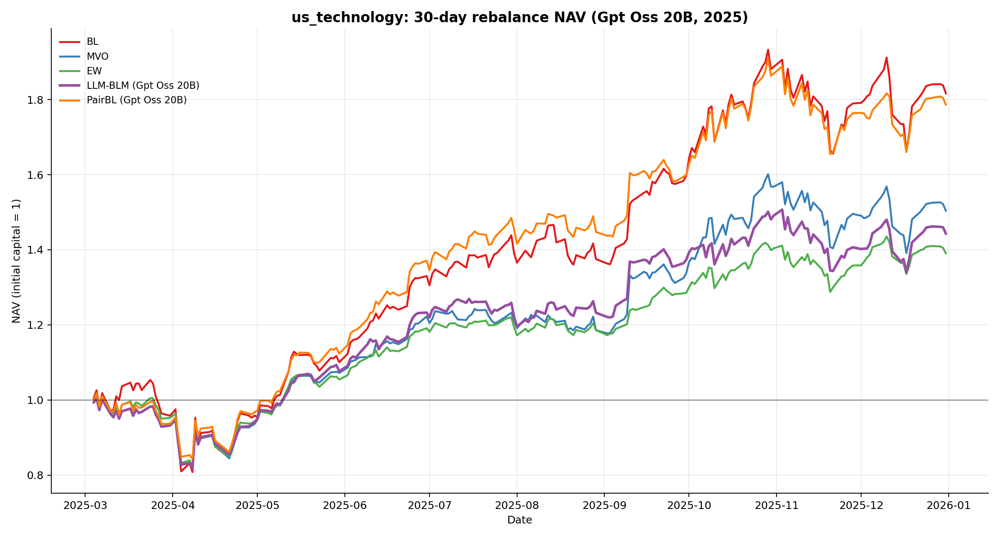

**60 ngày**

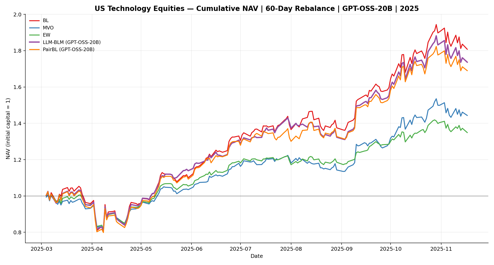

### us_financials

**30 ngày**

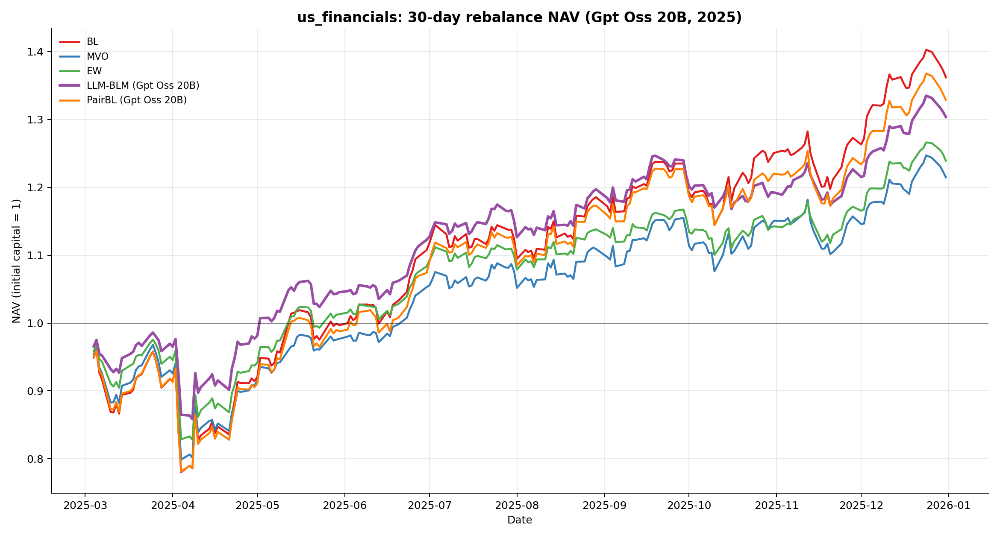

**60 ngày**

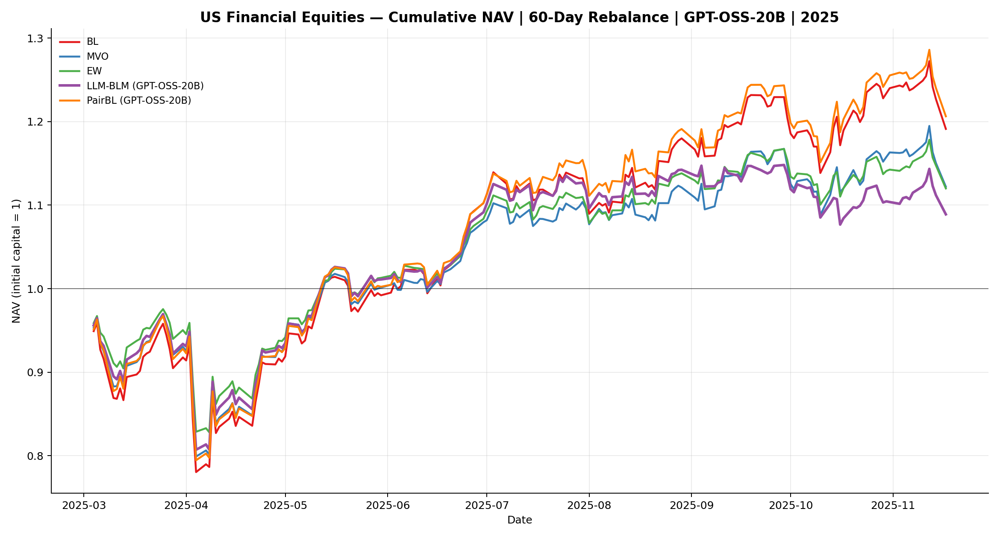

### cross_asset_etfs

**30 ngày**

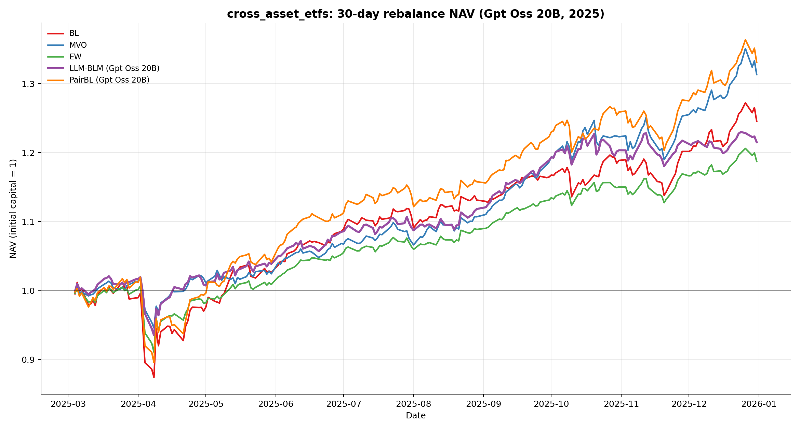

**60 ngày**

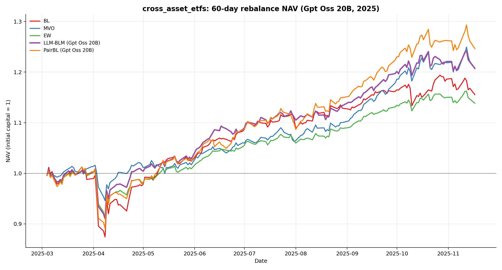

## Biểu đồ Drawdown

### us_technology

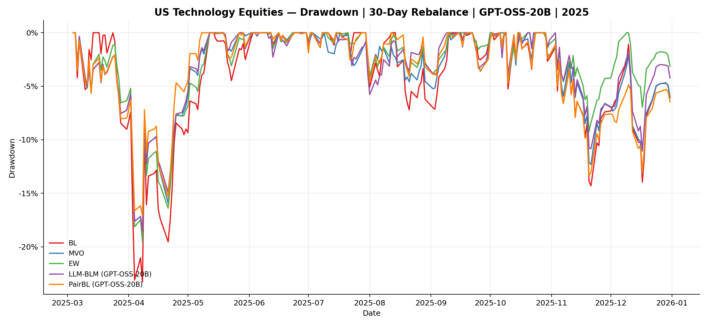

### us_financials

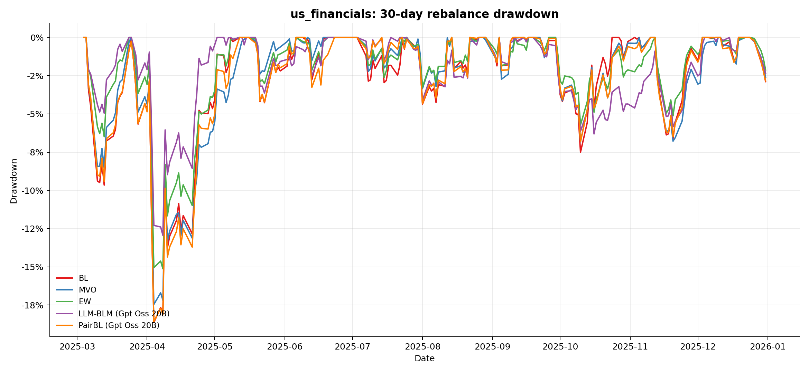

### cross_asset_etfs

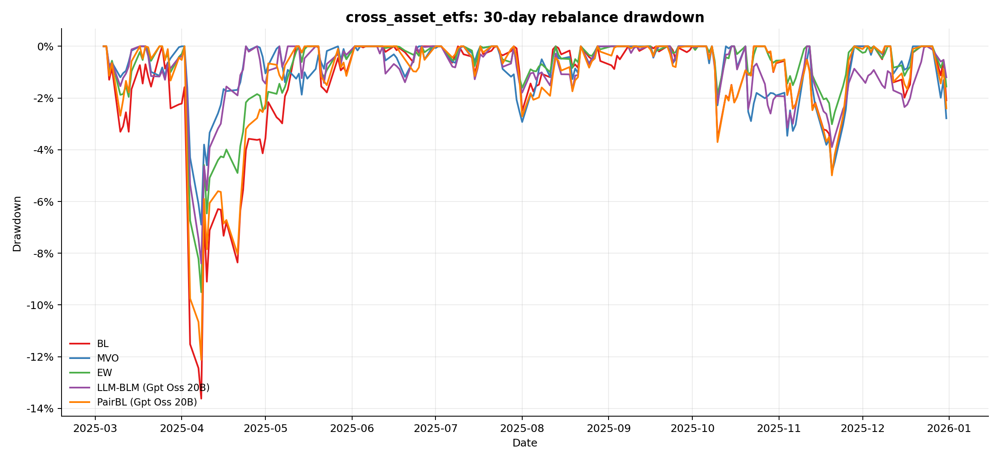

## Biểu đồ Metrics

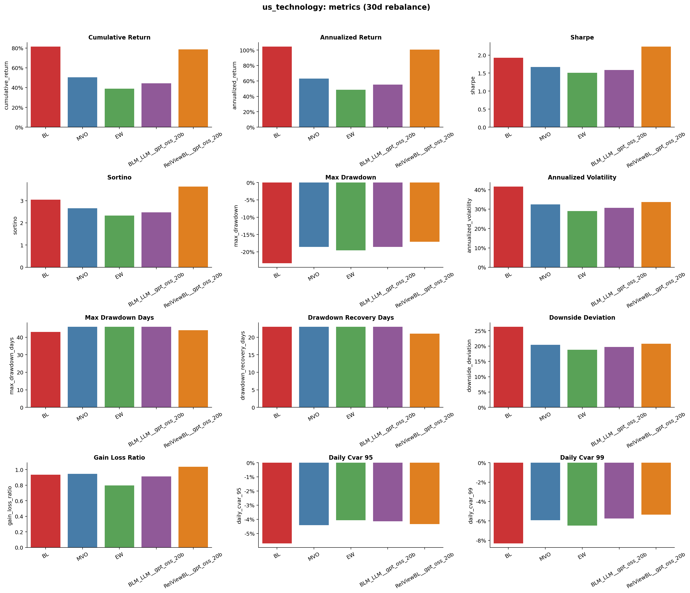

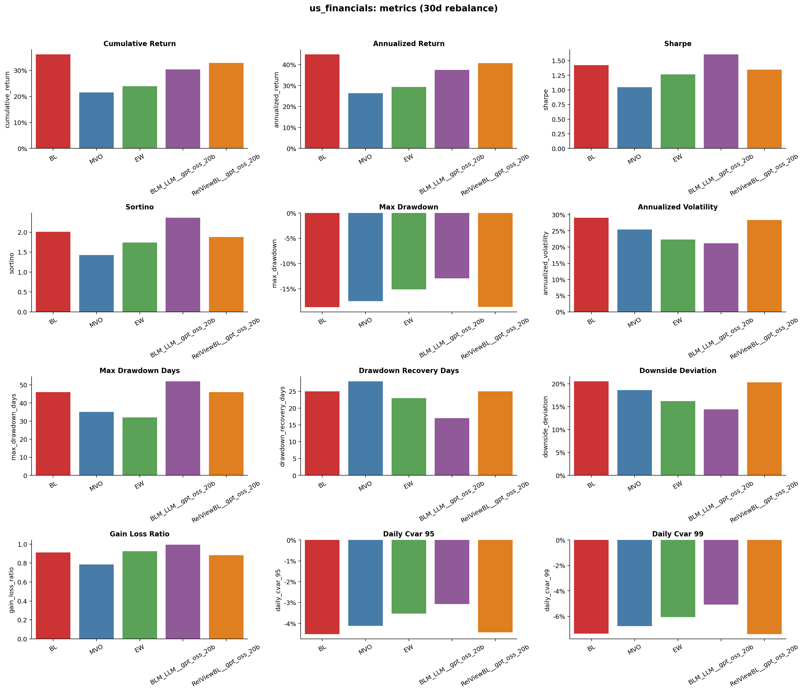

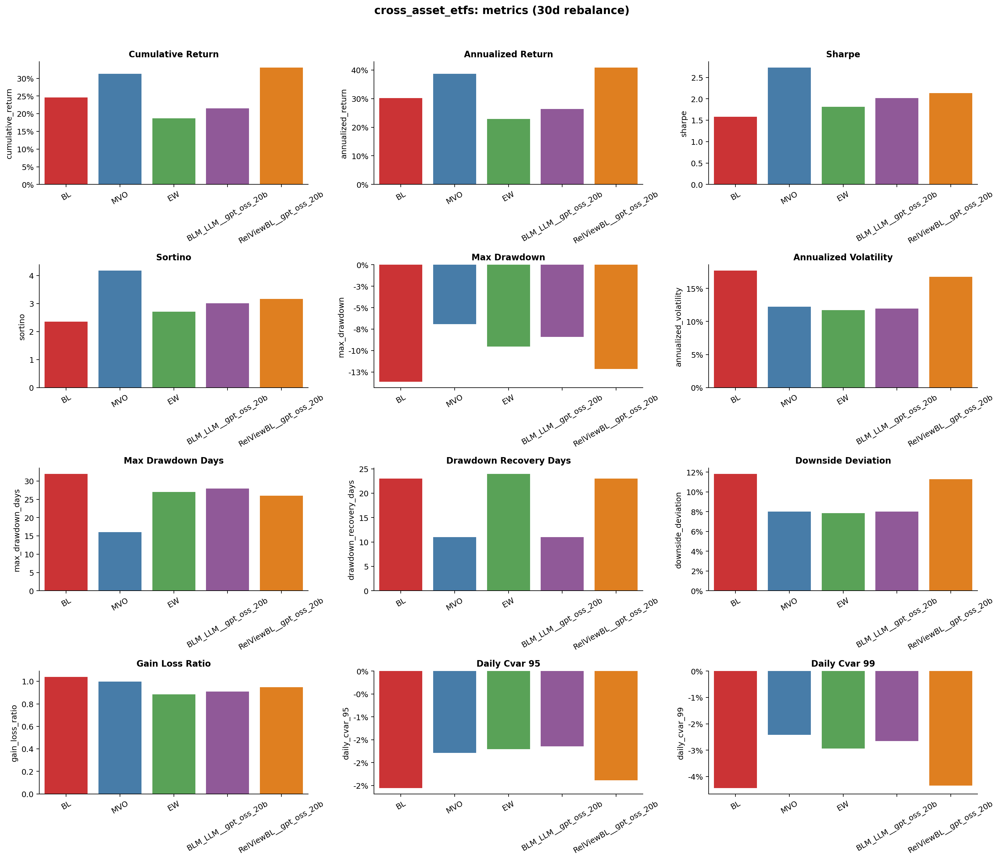

## Biểu đồ trọng số (Weight Heatmap)

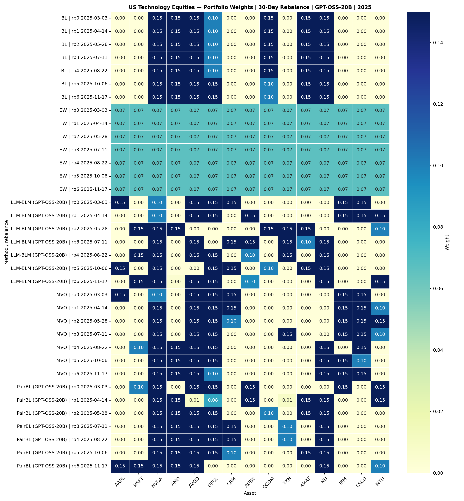

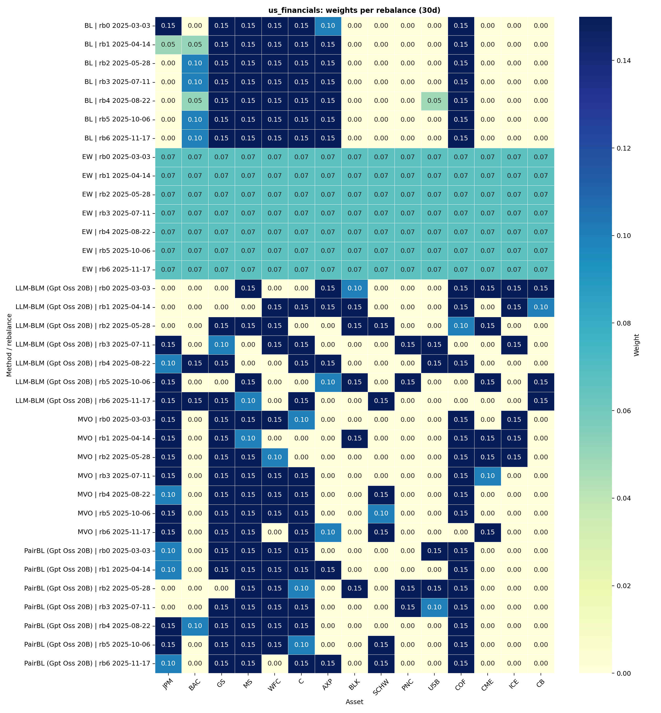

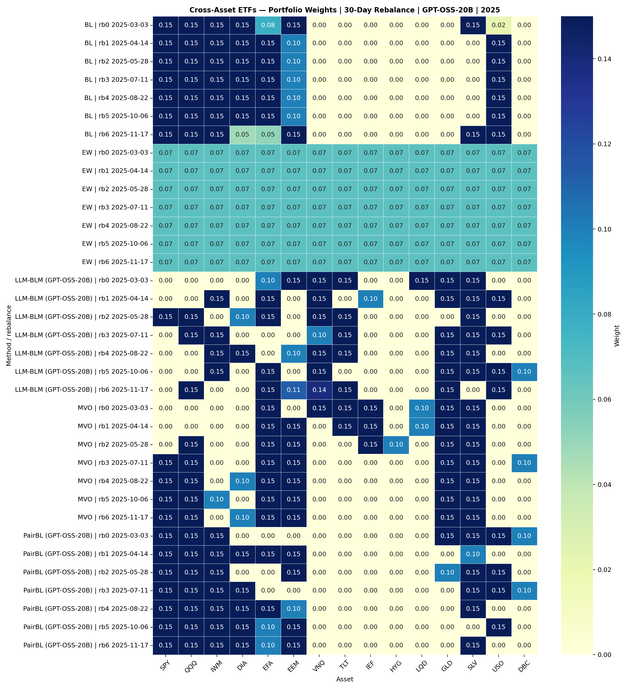

## Nhận xét chính

- **30 ngày tốt hơn 60 ngày** ở hầu hết các dataset: tái cân bằng thường xuyên hơn giúp bám sát views và giảm drawdown.
- **PairBL (GPT-OSS-20B)** đạt Sharpe cao nhất ở us_technology 30d (2.24) và dẫn đầu cumulative return ở us_financials / cross_asset_etfs.
- **LLM-BLM** vượt baselines về Sharpe ở us_financials 30d (1.61) với drawdown thấp nhất (-12.9%).
- **BL** là baseline mạnh nhờ prior equilibrium — các method LLM cần vượt qua điểm này.
- MVO rất mạnh ở cross_asset_etfs (Sharpe 2.73, Max DD chỉ -6.9%).

## Guardrails

- Các LLM calls được thực hiện sau cửa sổ test với tên asset nhận diện được, nên kết quả có thể chịu ảnh hưởng của training-cutoff hoặc leakage phía nhà cung cấp dù pipeline số là point-in-time.
- Đây là kết quả nghiên cứu, không phải bằng chứng cho hiệu suất live.

## Chạy lại

```powershell
$env:NVIDIA_API_KEY = "<key>"
py run_nvidia_nim_walkforward_2025.py --dry-run   # ước lượng số calls
py run_nvidia_nim_walkforward_2025.py             # chạy đầy đủ
```
